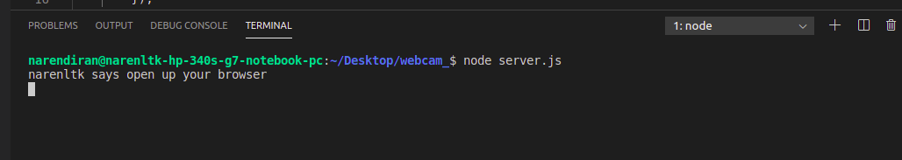

<p align="center">
  
</p>

# Using opencv4nodejs to stream your webcam with Express, ejs and Socket IO

## Medium Blog Link [Link](https://medium.com/swlh/video-streaming-using-opencv4nodejs-with-node-js-express-and-socket-io-3806abb049a)

Follow the steps to stream your webcam with Express and socket io

Link for Socket IO Content Delivery Network which is hosted by cloudflare [Link](https://cdnjs.com/libraries/socket.io)

### Step 1:

Open your terminal and git clone with the following command

```
git clone https://github.com/narenltk/webcam_.git
```

### Step 2:

Since I have given all the dependencies in the package.json all you need to do is give the following command

```
npm install
```

This command actually installs all the dependencies given in the package.json file.

### Step 3:

Once your done with all the steps given above all you to do is just fire up the server, with the following command and check your localhost

```
npm start

or

node server.js

or 

nodemon server.js
```

<p align="center">
  
</p>

checkout "http://localhost:3030"

I have used the port 3030 and you can change the port to any number you like.

## Note

You can also host the application by creating your own SSL certificate and the link for code for that is here [Link](https://github.com/narenltk/ssl_.git)

Or in any case your lazy like me you can also host the application using ngrok to host in a public server and with the following command

Linux users command:
```
./ngrok http 3030
```

windows users command:
```
ngrok http 3030
```
